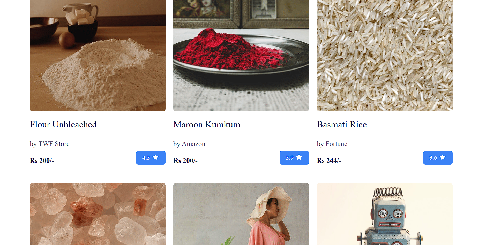
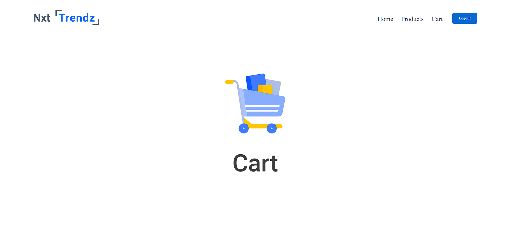
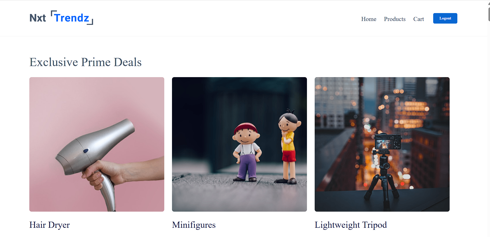
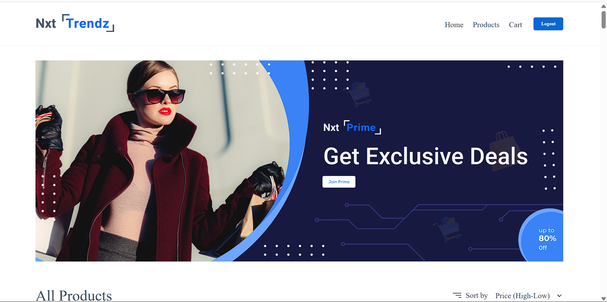

# 🛍️ React E-Commerce Web App

This is a simple, responsive **E-Commerce Web Application** built using the **MERN stack** (MongoDB, Express, React, Node.js). It includes features like product listing, sorting, authentication, cart management, and role-based access for **Prime and Non-Prime users**.

---

## 🚀 Features

- 🔐 **User Login** (with hardcoded user data for demo)
- 🏠 **Home Page** with featured content
- 🛒 **All Products Page** with sorting:
  - Price High → Low
  - Price Low → High
- ⭐ **Prime-only Exclusive Deals Page**
- 🙅‍♂️ **Non-Prime Users** are restricted from accessing premium deals
- 🧺 **Cart** system with Empty Cart UI
- ⚙️ React Router DOM for page navigation
- 🎨 Clean and responsive UI

---

## 👨‍💻 Demo Users

```js
// Example structure
{
  username: 'gladwintm',
  password: 'gladwin123',
  isPrime: true
}
## 📸 Screenshots

### 🔐 Login Page


### 🏠 Home Page


### 🛍️ All Products Page

Default View:  


Sorted: High → Low  
.png)

Sorted: Low → High  
.png)

### 🛒 Empty Cart


### ⭐ Prime-Only Deals


### 🙅‍♂️ Non-Prime User Restriction


